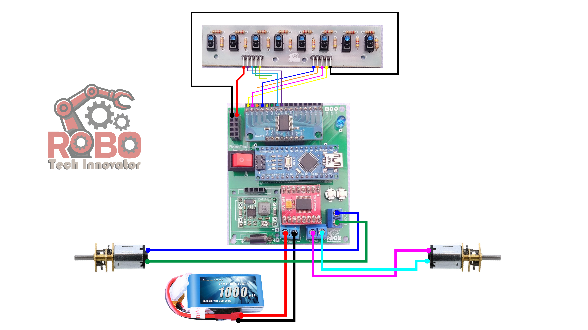

# Autonomous PID Line Follower Robot

[](https://www.arduino.cc/)
[](hardware/)
[](firmware/)
[](LICENSE)

> A high-speed, closed-loop autonomous line-following robot engineered using discrete **Proportional-Integral-Derivative (PID)** control algorithms and an 8-channel multiplexed infrared reflectance sensor bar. Engineered for zero-oscillation tracking on complex competition tracks featuring 90° sharp turns, cross junctions, and acute curves.

---

## ⚡ Technical Overview

Line tracking at high speeds requires instantaneous error estimation and proportional corrective actuation. This system samples an 8-channel infrared sensor array, computes a weighted position error relative to the track center, and dynamically modulates dual DC motor PWM duty cycles using a tuned PID loop.

### PID Mathematical Formulation
The motor differential correction value is calculated continuously:

$$\text{Error} = \sum_{i=1}^{8} (w_i \cdot S_i) - \text{Setpoint}$$

$$\text{Correction} = K_p \cdot e(t) + K_i \int e(t) \, dt + K_d \frac{de(t)}{dt}$$

Where:
- $K_p$: Proportional gain for rapid response to line displacement.
- $K_i$: Integral gain to eliminate steady-state drift on prolonged curvature.
- $K_d$: Derivative gain to prevent overshoot and dampen oscillatory hunting.

---

## 🖼️ Circuit & Wiring

<div align="center">



*Complete wiring: 8-channel IR array → analog MUX → Arduino Nano → TB6612FNG → two micro metal gearmotors, powered by a 3S 1000 mAh LiPo.*

 

</div>

| Motor | Forward | Backward | Speed (PWM) |
|:---|:---:|:---:|:---:|
| **Left** | D5 | D6 | D9 |
| **Right** | D2 | D4 | D3 |

---

## 🏗️ Repository Architecture

```
PID-Line-Follower-Robot/
├── firmware/
│   ├── 8IR_MUX_PID_Part-06.ino    # Main firmware entry point and execution loop
│   ├── PID_Controller.ino         # Closed-loop PID error calculation & tuning
│   ├── 8IR_sensor_reading.ino     # Multiplexed sensor ADC polling and calibration
│   ├── motor.ino                  # Dual H-Bridge PWM motor actuation
│   └── Turns.ino                  # Special condition logic (T-junctions, 90° bends, stops)
├── hardware/
│   └── Circuit-Diagram.jpg        # Complete schematic wiring diagram
└── docs/                          # Pin mapping and calibration notes
```

---

## 🔧 Hardware Specifications & Pin Mapping

| Component | Specification | Function |
| :--- | :--- | :--- |
| **Microcontroller** | Arduino Nano / Uno (ATmega328P) | 16 MHz control computation |
| **Sensor Array** | 8-Channel Analog IR Reflectance Bar | Ground reflectivity polling |
| **Multiplexer** | 74HC4051 / Analog MUX | Efficient ADC channel expansion |
| **Motor Driver** | Dual H-Bridge (L298N / TB6612FNG) | Bi-directional high-current motor control |
| **Motors** | Micro Metal Gearmotors (12V, 600–1000 RPM) | Low-inertia high-torque propulsion |
| **Power Source** | 2S/3S LiPo Battery (7.4V – 11.1V) | Low internal resistance high-discharge bus |

---

## 🚀 Calibration & Flashing

1. Open [`firmware/8IR_MUX_PID_Part-06.ino`](firmware/8IR_MUX_PID_Part-06.ino) in the Arduino IDE.
2. Ensure all modular files in `firmware/` are kept in the same sketch folder.
3. Calibrate black/white surface thresholds by reading raw values via `read_sensor.ino`.
4. Tune $K_p$, $K_i$, and $K_d$ gains iteratively using the serial monitor:
   - Start with $K_i = 0$ and $K_d = 0$. Increase $K_p$ until the robot follows the line with slight oscillation.
   - Increase $K_d$ to dampen oscillation and stabilize tracking on straightaways.
   - Add a small $K_i$ if the robot cuts inside sharp continuous curves.

---

## 📄 License
This project is open-source under the [MIT License](LICENSE).
